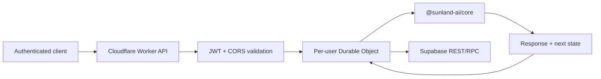

# Sunland AI

[English](README.md) | [简体中文](README.zh-CN.md)

Sunland AI is a deterministic, server-owned symbolic conversational engine. It combines structured parsing, semantic planning, user-taught knowledge, bounded user memory, graph reasoning, conversation continuity, community-language understanding, and personality rendering without calling an LLM.

The repository is a private TypeScript/npm-workspaces monorepo. Production clients send authenticated turns to a Cloudflare Worker; they never download or execute the symbolic Core.

## What is implemented

- A framework-independent Core with deterministic parsing, structured clarification, knowledge teaching, name memory, direct and transitive reasoning, explainable “why” answers, topic continuity, initiative planning, community pragmatics, and Frost/Plain personalities.
- A Cloudflare Worker API that verifies application JWTs, enforces CORS and per-user rate limits, and routes each user through one Durable Object.
- Atomic Supabase persistence for Knowledge, Memory, per-conversation Context, optimistic revisions, migration receipts, and seven-day idempotent turn results.
- A multilingual Vite/React Playground scaffold for future development tooling.
- Contract, recovery, security-boundary, fixed-evaluation-corpus, Worker, and persistence tests.

Sunland AI is not a general-purpose generative model. It answers within its explicit rules and stored knowledge, and safely asks for clarification or more information when it cannot justify an answer.

## Architecture



The Durable Object serializes a verified user's requests and stores only ephemeral rate-limit state. Supabase is the durable source of truth. The turn commit stores the response and all state changes in one transaction, so a persistence failure is never returned as success.

See [Architecture](docs/architecture.md) for component and state ownership details.

## Repository layout

| Path | Responsibility |
|---|---|
| `packages/core` | Symbolic Core, public workspace SDK boundary, contracts, and Core tests |
| `apps/api` | Cloudflare Worker, authentication, validation, Durable Object, and Supabase repository |
| `apps/playground` | Multilingual React development scaffold; not a production client |
| `supabase/migrations` | Preparation migrations and an explicitly deferred legacy-security gate |
| `docs` | Architecture, API, development, deployment, and durable project context |

## Quick start

Requirements:

- Node.js 20 or later
- npm with workspace support

```bash
git clone https://github.com/ikun-1145/sunland-ai.git
cd sunland-ai
npm install
npm run typecheck
npm test
npm run build
```

`npm run build` type-checks the Core and Playground and performs a Cloudflare dry-run build. It does not deploy.

### Run the Playground

```bash
npm run dev:playground
```

Vite prints the local URL. The current Playground is a translated four-panel visual scaffold; it is not connected to the Worker and should not be used to verify production conversations.

### Run the API locally

Copy the example variables and replace every placeholder with development-only credentials:

```bash
cp apps/api/.dev.vars.example apps/api/.dev.vars
npm run dev:api
```

The public health check requires no token:

```bash
curl http://localhost:8787/healthz
```

All `/v1/*` routes require an application-issued HS256 JWT. Never commit `apps/api/.dev.vars`, real tokens, or Supabase keys. See [Development](docs/development.md) and the [HTTP API](docs/api.md) for the complete local workflow and request examples.

## Core workspace usage

The Core package is private and intended for this monorepo. Internal server code imports only its public package boundary:

```ts
import { createSunlandEngine } from "@sunland-ai/core";

const engine = createSunlandEngine({
  semanticMode: "passive",
  semanticContextMode: "enabled",
});

const result = engine.process("你好");
console.log(result.response);
```

Do not import implementation paths under `packages/core/src/*` from a host package. Production clients must call the Worker API instead of embedding the Core.

## Verification

```bash
npm run typecheck
npm test
npm run build
```

Focused checks:

```bash
npm run test:contract --workspace @sunland-ai/core
npm test --workspace @sunland-ai/api
```

There is currently no repository lint script.

## Documentation

- [Documentation index](docs/README.md)
- [Architecture](docs/architecture.md)
- [Development guide](docs/development.md)
- [HTTP API](docs/api.md)
- [Deployment runbook](docs/deployment.md)
- [Core SDK and contracts](packages/core/docs/sdk.md)
- [Contributing](CONTRIBUTING.md)
- [AI contributor instructions](AGENTS.md)

## Deployment safety

Worker secrets are intentionally absent from the repository. Use Wrangler secrets for deployed environments and development-only values in `apps/api/.dev.vars`.

The numbered migrations directly under `supabase/migrations` are the normal preparation set. The migration under `supabase/migrations/deferred` must not be applied until the historically signed forced-upgrade client and every gate in [the deployment runbook](docs/deployment.md) have been verified. During the preparation phase, the legacy `conversations` and `usage` tables must not be described as fully isolated by RLS.

## Status and license

Sunland AI is at version `0.1.0` and is not published as a public npm package. The Playground is development scaffolding, while the Worker/Core path is the production architecture.

Licensed under the [MIT License](LICENSE).
