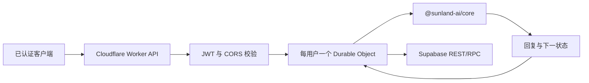

# Sunland AI

[English](README.md) | [简体中文](README.zh-CN.md)

Sunland AI 是一个确定性的、由服务端持有的符号对话引擎。它不调用 LLM，而是通过结构化解析、语义规划、用户教学知识、受限用户记忆、图推理、会话连续性、社区语言理解和人格渲染生成回复。

本仓库是私有的 TypeScript/npm workspaces 单仓库。生产客户端只向 Cloudflare Worker 发送已认证的对话轮次，不下载、也不执行符号 Core。

## 已实现能力

- 与框架无关的 Core：确定性解析、结构化澄清、知识教学、姓名记忆、直接与传递推理、可解释的“为什么”回答、话题连续性、主动性规划、社区语用理解，以及 Frost/Plain 两种人格。
- Cloudflare Worker API：校验应用 JWT、执行 CORS 与用户级限频，并将同一用户的请求交给同一个 Durable Object。
- Supabase 原子持久化：保存 Knowledge、Memory、会话级 Context、乐观并发版本、迁移回执和保留七天的幂等 turn 结果。
- 用于后续开发工具的多语言 Vite/React Playground 脚手架。
- 覆盖公开契约、恢复、安全边界、固定评估集、Worker 和持久化的测试。

Sunland AI 不是通用生成式模型。它只在明确规则和已有知识能够支持时回答；无法证明答案时，会安全地请求澄清或补充信息。

## 架构



Durable Object 负责串行化同一已验证用户的请求，只保存临时限频状态；Supabase 是持久化状态的唯一事实来源。每次 turn 的回复和所有状态变更在一个事务中提交，因此持久化失败绝不会被当作成功返回。

详细职责与状态所有权见[架构说明](docs/architecture.md)。

## 仓库结构

| 路径 | 职责 |
|---|---|
| `packages/core` | 符号 Core、工作区公开 SDK 边界、契约与 Core 测试 |
| `apps/api` | Cloudflare Worker、认证、校验、Durable Object 与 Supabase Repository |
| `apps/playground` | 多语言 React 开发脚手架；不是生产客户端 |
| `supabase/migrations` | 准备迁移和明确延后的旧系统安全门禁 |
| `docs` | 架构、API、开发、部署和长期项目上下文 |

## 快速开始

环境要求：

- Node.js 20 或更高版本
- 支持 workspaces 的 npm

```bash
git clone https://github.com/ikun-1145/sunland-ai.git
cd sunland-ai
npm install
npm run typecheck
npm test
npm run build
```

`npm run build` 会检查 Core 与 Playground，并执行 Cloudflare dry-run 构建；它不会部署服务。

### 运行 Playground

```bash
npm run dev:playground
```

本地地址由 Vite 输出。当前 Playground 是包含四个占位面板的多语言视觉脚手架，尚未连接 Worker，不能用于验证生产对话链路。

### 本地运行 API

复制环境变量示例，并将所有占位值替换为仅用于开发的凭据：

```bash
cp apps/api/.dev.vars.example apps/api/.dev.vars
npm run dev:api
```

公开健康检查不需要 Token：

```bash
curl http://localhost:8787/healthz
```

所有 `/v1/*` 路由都需要由应用签发的 HS256 JWT。不要提交 `apps/api/.dev.vars`、真实 Token 或 Supabase 密钥。完整本地流程和请求示例见[开发指南](docs/development.md)与 [HTTP API](docs/api.md)。

## Core 工作区用法

Core 包是私有包，只供本单仓库使用。服务端内部代码只能从公开包边界导入：

```ts
import { createSunlandEngine } from "@sunland-ai/core";

const engine = createSunlandEngine({
  semanticMode: "passive",
  semanticContextMode: "enabled",
});

const result = engine.process("你好");
console.log(result.response);
```

宿主包不得直接导入 `packages/core/src/*` 下的实现路径。生产客户端必须调用 Worker API，不能嵌入 Core。

## 验证

```bash
npm run typecheck
npm test
npm run build
```

聚焦检查：

```bash
npm run test:contract --workspace @sunland-ai/core
npm test --workspace @sunland-ai/api
```

仓库当前没有 lint 脚本。

## 文档

- [文档索引](docs/README.md)
- [架构说明](docs/architecture.md)
- [开发指南](docs/development.md)
- [HTTP API](docs/api.md)
- [部署手册](docs/deployment.md)
- [Core SDK 与契约](packages/core/docs/sdk.md)
- [贡献指南](CONTRIBUTING.zh-CN.md)
- [AI 协作说明](AGENTS.md)

## 部署安全

Worker 密钥不会进入仓库。已部署环境使用 Wrangler secrets，本地开发值只放在 `apps/api/.dev.vars`。

`supabase/migrations` 目录直属的编号迁移是常规准备迁移。`supabase/migrations/deferred` 下的迁移只有在历史签名强制升级客户端和[部署手册](docs/deployment.md)列出的全部门禁都验证完成后才能应用。在准备阶段，不能把旧 `conversations` 和 `usage` 表描述成已由 RLS 完全隔离。

## 状态与许可证

Sunland AI 当前版本为 `0.1.0`，没有作为公开 npm 包发布。Playground 仍是开发脚手架；Worker/Core 链路是当前生产架构。

项目采用 [MIT License](LICENSE)。
